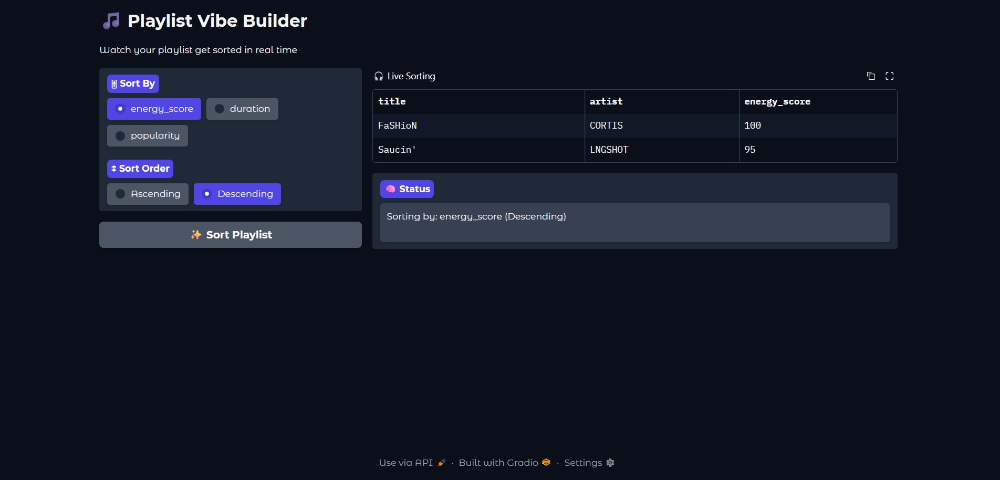

# Project Title
**Playlist Sorting Visualization Using Merge Sort**

## Chosen Problem : 
This project sorts a list of songs based off of user selected sorting keys. It outputs a concise, easily readable, list.

## Chosen Algorithm :
Merge Sort was chosen because it is efficient (O(n log n)) and naturally works through recursion and splitting, which makes it ideal for visual step-by-step animation in a playlist sorting interface.

---------------------------------------------------------

## Demo video/gif/screenshot of test

The following screenshot shows the output produced after running a demo version of the code. This test used a smaller playlist containing four songs. However, during initial testing, only part of the songs were visible in the output display at certain stages of the animation. At first, this looked like a layout issue in the interface, since entering full-screen mode allowed all songs to be displayed correctly and in the expected order.

After looking through my code, I realised the issue was caused by the DataFrame changing size between sorting frames. Since Merge Sort produces intermediate states with different list lengths during merging, the table would sometimes shrink depending on the current step.

To fix this, I updated the Gradio DataFrame output so the table size stays consistent across all frames by adding placeholder rows when needed. This keeps the animation stable and easier to follow.

---------------------------------------------------------

# Problem Breakdown & Computational Thinking

# Brief Summary Of Project :
This project sorts a playlist of songs using Merge Sort. The dataset is a list of dictionaries, where each song contains a title, artist, and numeric attributes (energy_score, duration and popularity). The user selects which attribute to sort by, and the algorithm visually animates sorting process step-by-step in a Gradio interface.

### Decomposition
Merge Sort is broken into smaller steps that repeat recursively. The main steps are:
 - Split the playlist into two halves
 - Keep splitting each half until each sublist has only one song
 - Compare elements from the left and right sublists
 - Merge them back together in sorted order
 - Repeat until the full playlist is rebuilt in sorted form
Each of these steps is handled separately in the "merge_sort()" and "merge()" functions.

### Pattern Recognition
The algorithm repeatedly follows the same pattern:
 - Take the smallest elements from two sorted sublists
 - Compare their selected attribute values (converted to integers)
 - Place the smaller (or larger if in descending order) value into the result list
 - Move forward through both sublists until all elements are merged
This comparison-and-insertion pattern repeats at every level of recursion until the full list is sorted.

### Abstraction
**Shown to the user:**
 - The playlist order changing step-by-step, at a quick speed.
 - The selected sort key (Energy Score, Duration, or Popularity)
 - The sorting direction (Ascending or Descending)
 - The intermediate states of the playlist during merging

**Hidden from the user:**
 - The recursive splitting process
 - The internal index tracking ("i" and "j")
 - Temporary sublists created during recursion
 - Low-level comparisons inside the merge function

The UI only shows clean playlist snapshots using a table, so the user focuses on how the order changes instead of the internal code.

### Algorithm Design (In Summary)
**Input:**
 - Playlist data (list of dictionaries)
 - User selection:
    - Sort attribute (Energy Score / Duration / Popularity)
    - Sort order (Ascending / Descending)

**Processing:**
 - Convert selected attribute into a usable key
 - Run custom Merge Sort on a copy of the playlist
 - Convert string values into integers for comparison
 - Store each intermediate sorting state in a "frames" list
 - Yield each frame one-by-one to simulate an animation

**Output:**
 - A live-updating table in the Gradio interface showing the playlist being sorted step-by-step
 - A status message showing the current sort type and order

### Data Structures Used
 - **List of dictionaries**: Used to store the playlist (each song is a dictionary)
 - **Strings**: Used for song titles and artist names
 - **Integers (converted from strings)**: Used for sorting comparisons (energy_score, duration, popularity)
 - **List (frames)**: Stores each intermediate step of the sorting process for animation in the UI

---------------------------------------------------------

## Steps to Run
1. Install dependencies:
 - pip install gradio pandas
2. Run the script:
 - python app.py
3. Open the local Gradio link provided in the terminal
4. Select a sorting option:
 - Sort By (Energy Score / Duration / Popularity)
 - Sort Order (Ascending / Descending)
5. Click the “Sort Playlist 🎧” button
6. Watch the playlist sort.

---------------------------------------------------------
---------------------------------------------------------
---------------------------------------------------------

## Hugging Face Link

---------------------------------------------------------

## Testing :
The following tests were performed:
- Sorted playlist by Energy Score, Duration, and Popularity
- Tested ascending and descending order for each attribute
- Verified correct sorting behavior with duplicate values
- Tested already sorted playlist to observe best-case behavior
- Tested minimal playlist (1–2 songs) to verify base case handling

Edge cases handled:
- Duplicate attribute values
- Very small playlists
- Already sorted playlists
- Numeric Conversions

---------------------------------------------------------

## Author & AI Acknowledgment
This Project was created by Eyiniseoluwa Momolosho.

AI assistance was used to help structure explanations and improve clarity in the documentation. It also supported the development of the sorting animation and Gradio interface design. Draft versions of the code were reviewed with AI suggestions, and some improvements were made to variable naming and UI layout.The core Merge Sort algorithm and overall implementation were written, tested, and understood by me.
